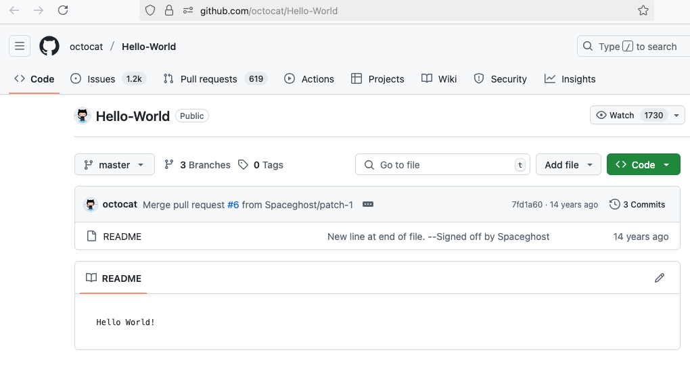

# What is GitHub?

  

  

Before we dive into installation and setup, let's understand what GitHub is:

**GitHub** is a web-based platform that uses **Git** for version control. Think of it as:

- **A cloud-based code repository** with version tracking and collaboration features
- **A social network for developers and researchers** 
- **A backup system** that keeps track of every change you make
- **A collaboration tool** that lets multiple people work on the same project

**Git vs. GitHub:**

- **Git** = A version control system (software) invented by Finnish Linus Torvalds in 2005
- **GitHub** = The online platform that hosts Git repositories

## What You'll Learn

In the following chapters, we'll walk through everything you need to get started:

**Chapter 2: Install and Configure Git**

- Install Git on your local machine (macOS, Windows, Linux)
- Set up your Git identity
- Verify everything is working

**Chapter 3: Create Your GitHub Account**

- Sign up for GitHub

**Chapter 4: Personal Access Token**

- Set up secure GitHub authentication with a Personal Access Token (PAT)

**Chapter 5: Essential Git Commands**

- Learn the basic Git commands you'll use daily
- Understand the Git workflow

**Chapter 6: Complete GitHub Workflow**

- Put it all together
- Create your first repository
- Learn the simple daily workflow

---

**Next:** Install Git on your computer and configure your identity.