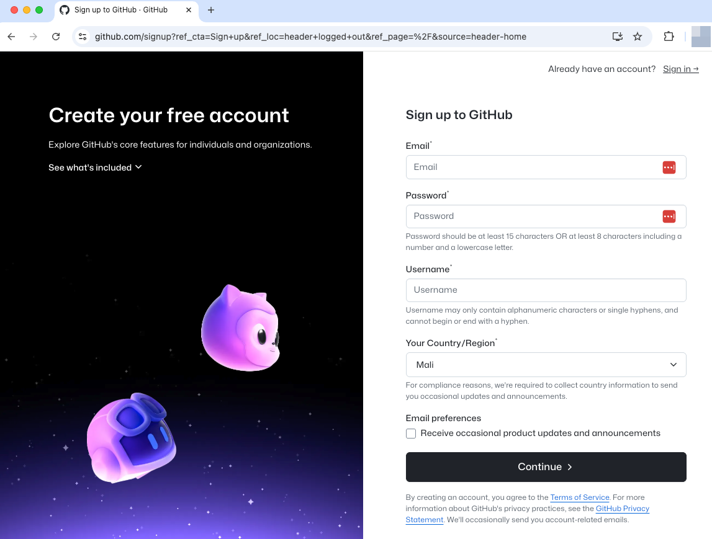

# Create Your GitHub Account

  

  

## Visit GitHub

1. Go to [github.com](https://github.com)
2. Click the **"Sign up"** button (green button in top right)

## Choose Your Username

**⚠️ Important**: Your username will be part of your professional identity online.

**Good username examples:**

- `john-smith-research`
- `j.smith.phd`
- `johnsmith-bio`
- `drjohnsmith`

**Avoid:**

- Random numbers: `johnsmith12345`
- Too casual: `coolguy2023`
- Too long: `john-smith-professor-of-biology-at-university`

## Fill Out the Form

1. **Username**: Choose carefully (see above)
2. **Email**: Use your academic email if possible
3. **Password**: Use a strong password
4. **Verify account**: Complete the puzzle/verification

## Choose Your Plan

- **Free plan** is perfect for academic use
- Includes unlimited public repositories
- Includes unlimited private repositories
- Click **"Create account"**

## Complete Email Verification

1. Check your email for verification message
2. Click the verification link
3. This activates your account

**That's it!** Your GitHub account is now ready to use.

---

**Next Chapter Preview**: We'll set up Personal Access Tokens and configure platform-specific authentication so your computer can securely communicate with GitHub. 