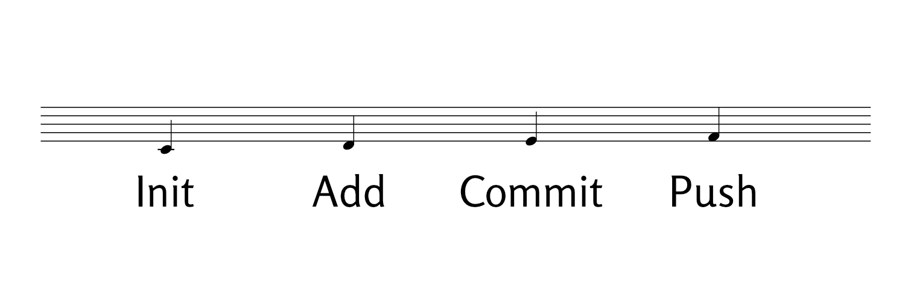

# Complete GitHub Workflow


<br><br>
<div style="text-align: center;">

</div>
<br><br>


## Getting Your Work on GitHub

Now that you have Git installed and authentication set up, let's create your first repository and learn the simple workflow you'll use every day.

## Step 1: Create Repository on GitHub

1. Click the green **"New"** button on GitHub
2. **Repository name**: `my-project` (or whatever you prefer)
3. Make it **Public** (required for free hosting)
4. **Don't** check "Add a README" (you already have one)
5. Click **"Create repository"**

## Step 2: Connect Your Local Site to GitHub

Copy the commands GitHub shows you, but here's what you'll run:

```bash
# Make sure you're in your project directory
cd ~/projects/my-project

# Create a sample file if you don't have any files yet
touch README.md
echo "# My Project" > README.md

# Add your changes
git add .
git commit -m "My project setup"

# Set branch to main (important!)
git branch -M main

# Connect to your GitHub repository
git remote add origin https://github.com/YOUR-USERNAME/my-project.git

# Push to GitHub
git push -u origin main
```

**Replace YOUR-USERNAME with your actual GitHub username.**


## Common Git Commands

Here are the **only Git commands you need as a beginner:**

### See what's changed
```bash
git status
```

### Save changes locally
```bash
git add .
git commit -m "Description of what you changed"
```

### Send to GitHub
```bash
git push
```

### Get latest from GitHub (if editing from multiple computers)
```bash
git pull
```

## Daily Workflow Example

Here's what a typical day looks like:

**Morning** (if you work on multiple computers):
```bash
git pull    # Get any changes from other computers
```

**After making changes:**
```bash
git status  # See what you've changed
git add .   # Stage all changes
git commit -m "Updated content with new information"
git push    # Send to GitHub
```

**That's literally it!** You now know everything you need to manage your project with Git and GitHub.

## Common Commit Messages

Here are examples of good commit messages:

```bash
git commit -m "Added new content to main page"
git commit -m "Updated about section with new information"
git commit -m "Fixed typo in contact information"
git commit -m "Added image to about page"
git commit -m "Updated project documentation"
```

## Troubleshooting

### If you get an error about authentication:
- Make sure you're using your Personal Access Token (not your password)
- Check that your token hasn't expired
- Review the authentication setup from Chapter 4

### If you get merge conflicts:
- This happens if you edit from multiple computers
- Run `git pull` first, then resolve any conflicts in the files
- Then `git add .`, `git commit`, and `git push`
- If the merge conflict is not resolved, refer to my separate [e-book on problems with diverging branches](https://divergent-branches-en.netlify.app/).


## Next Steps

Congratulations! You now have:

- ✅ Git installed and configured
- ✅ GitHub account with secure authentication
- ✅ Your first repository
- ✅ A simple daily workflow

You're ready to start building and maintaining your project with confidence!

---

**What's Next?** Consider exploring:

- GitHub Pages for hosting your project
- Other hosting platforms for more advanced features
- GitHub Desktop if you prefer a visual interface
- VS Code integration for editing directly in your code editor 